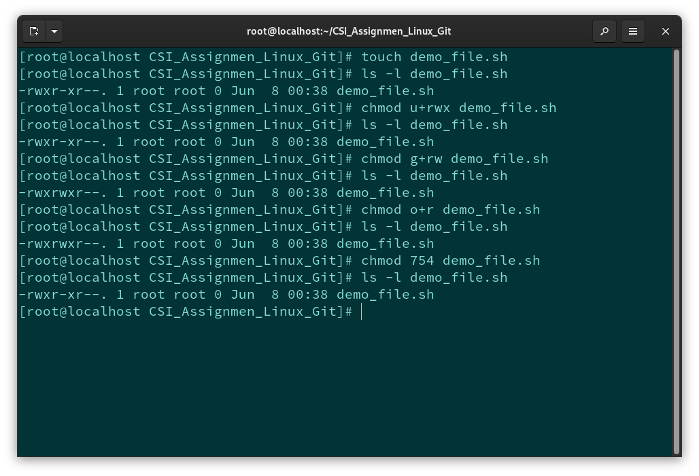
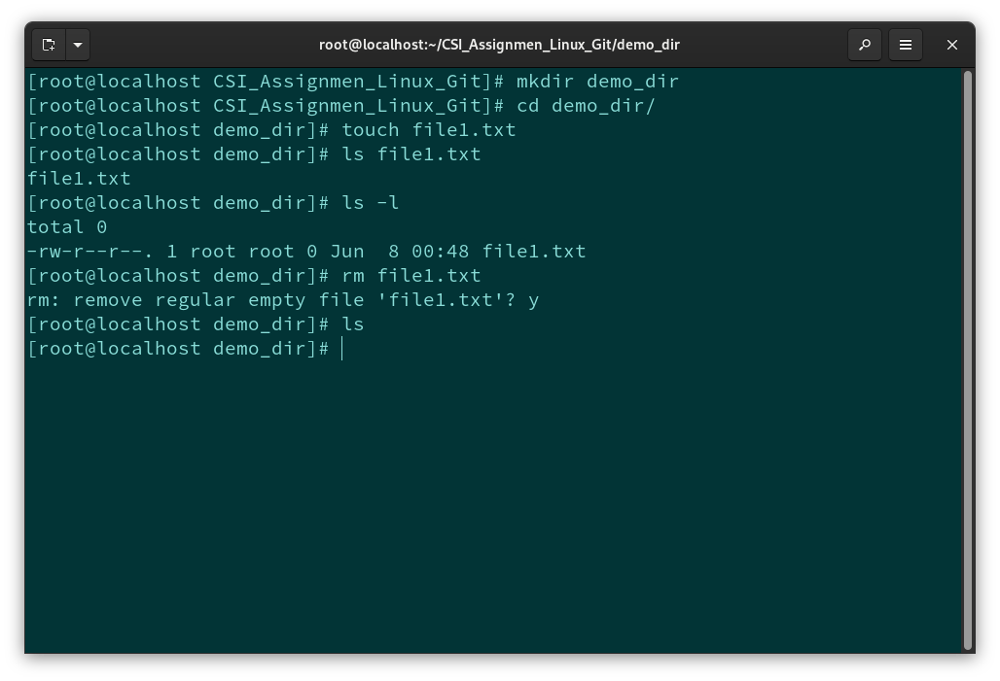
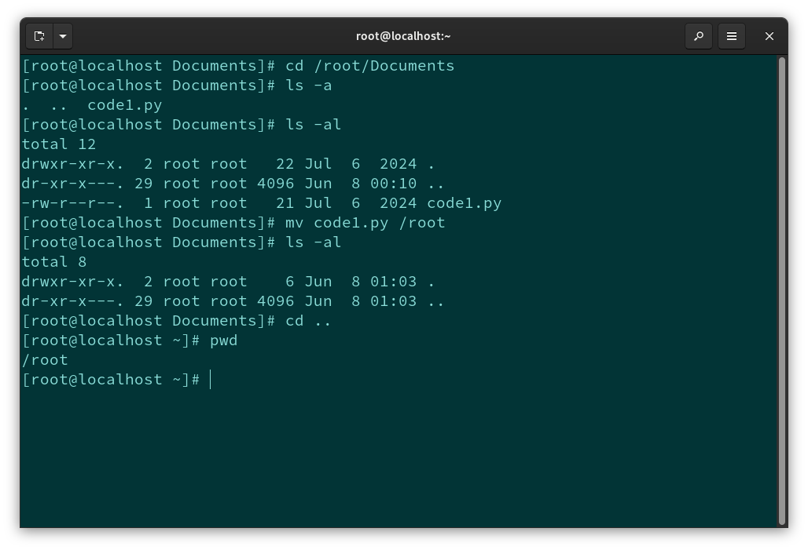
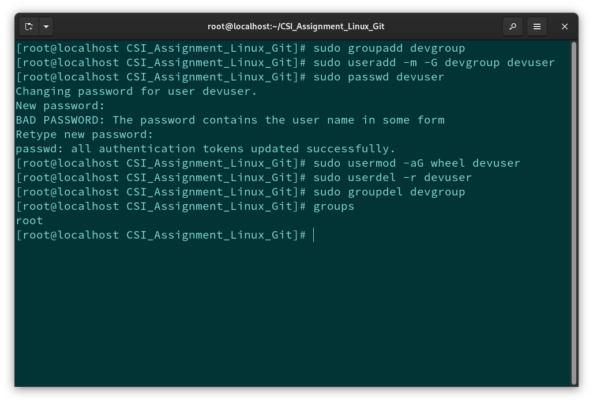
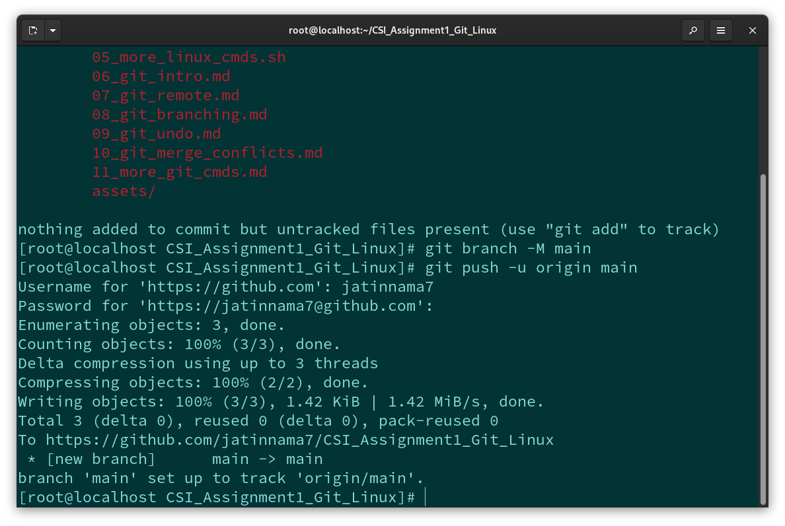
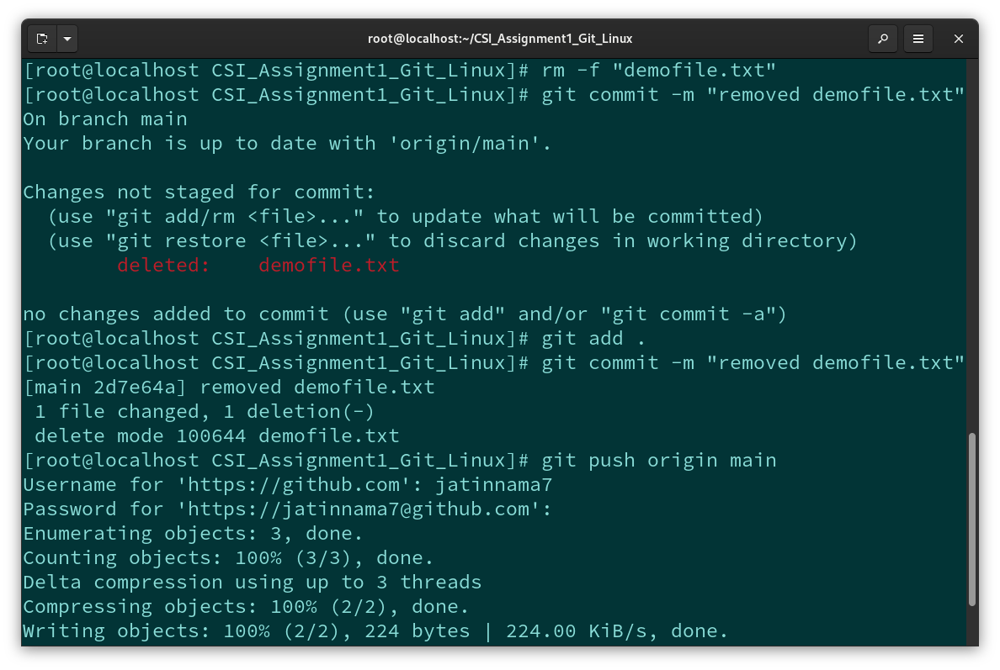
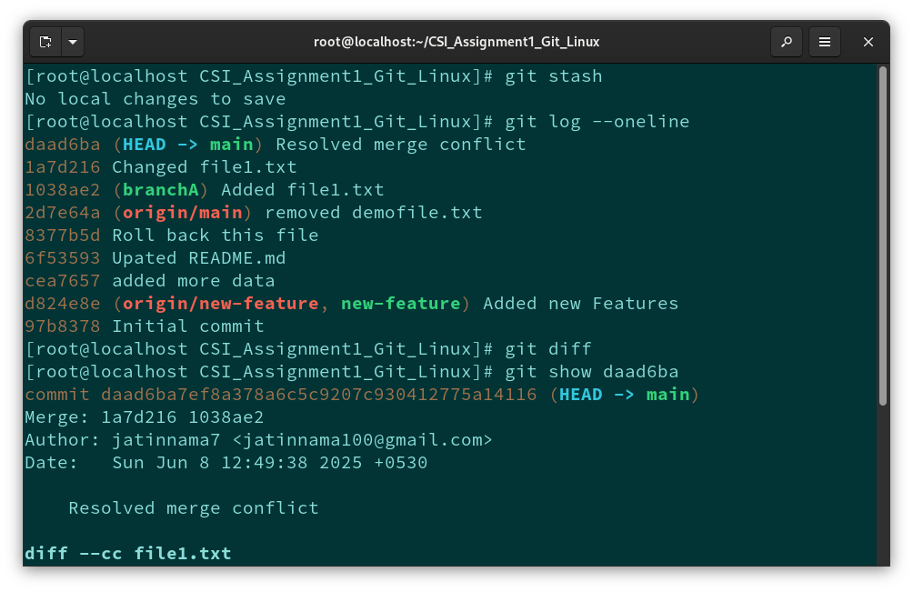

# 💻 Linux & Git Basics – Week 1 Assignment

Welcome to my Week 1 Assignment for mastering **Linux & Git Fundamentals**!  
This assignment includes 🔧 terminal practices, 🗂️ file management, 👥 user & group control, and 🌿 Git workflows.

> 🎯 **Submission Type**: GitHub Repo / ZIP  
> 📁 **Total Tasks**: 11

## 📂 Folder Overview

| Task No. | Topic                     | File                        | Description                                        |
| -------- | ------------------------- | --------------------------- | -------------------------------------------------- |
| 1        | File Permissions          | `01_file_permissions.sh`    | ✅ `1. File Permissions and chmod`                 |
| 2        | Basic Linux Commands      | `02_basic_linux_cmds.sh`    | ✅ `2. Basic Linux Commands`                       |
| 3        | Navigation                | `03_navigation.sh`          | ✅ `3. Navigation and Moving Files`                |
| 4        | User & Group Mgmt         | `04_user_mgmt.sh`           | ✅ `4. Create User & Group, Manage Permissions`    |
| 5        | More Linux Cmds           | `05_more_linux_cmds.sh`     | ✅ `5. More Linux Commands`                        |
| 6        | Git Basics                | `06_git_intro.md`           | ✅ `Git Basics: Intro & Setup`                     |
| 7        | Remote Repo               | `07_git_remote.md`          | ✅ `7. Setup Remote Repo and Push`                 |
| 8        | Git Branching & PR        | `08_git_branching.md`       | ✅ `8. Git Branching and Merging`                  |
| 9        | Undo Commit / Remove File | `09_git_undo.md`            | ✅ `9. Undo Last Commit / Remove File from Remote` |
| 10       | Merge Conflict            | `10_git_merge_conflicts.md` | ✅ `10. Merge Conflict Resolution`                 |
| 11       | More Git Commands         | `11_more_git_cmds.md`       | ✅ `11. More Git Practice`                         |

---

## 📸 Proof of Completion (Task-wise)

### ✅ 1. File Permissions (`chmod`, `ls -l`)

---

### ✅ 2. Basic Linux Commands

---

### ✅ 3. Navigating Directories

---

### ✅ 4. Creating Users & Groups

---

### ✅ 5. More Linux Practice

.png>)
.png>)
.png>)
.png>)

---

### ✅ 6. Git Installation & Basics

---

### ✅ 7. Pushing to Remote

---

### ✅ 8. Git Branching and Merging

---

### ✅ 9. Undo Last Commit

---

### ✅ 10. Merge Conflict Resolution

---

### ✅ 11. More Git Practice

---

## 🚀 Technologies & Tools

- 🐧 Linux Terminal (RHEL/Ubuntu)
- 🔧 Bash Scripting
- 🌿 Git & GitHub
- 📸 Screenshot Tools (`gnome-screenshot`, `Snipping Tool`)
- 📂 VS Code

---

## 📚 Resources

- 📹 [Linux Basics YouTube](https://www.youtube.com/watch?v=iwolPf6kN-k)
- 📘 [Git Book](https://git-scm.com/book/en/v2)
- 💻 [Git Basics Youtube](https://git-scm.com/book/en/v2)
- 🧑‍💻 [RedHat Linux Guides](https://git-scm.com/book/en/v2)
